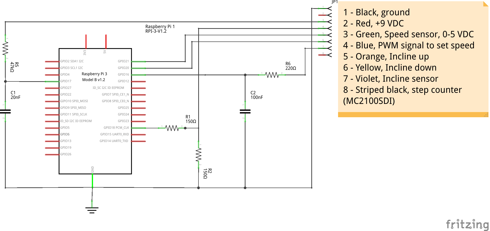

# NordicHack

This project implements a controller and web interface for treadmills that use
the MC2100LTS-30 motor controller board (Icon part number 263165). This likely
includes many Icon Fitness treadmills under various brand names such as
Epic, NordicTrack, Proform, Reebok, and probably others. Use the part search
form at [Icon Service Canada](https://www.iconservice.ca/CustomerService/parts)
or [Icon Service](https://www.iconservice.com/CustomerService/parts.do) to
search for part number 263165 to see if your model might work.

The long term goal is to allow for control of treadmill speed and incline, easy
construction of training programs, and recording fitness data, including heart rate
(via a USB ANT+ dongle).

# Interface hardware

Here is a very basic schematic for hooking the Pi up to the controller board. There is no need to cut anything to do this: the cable linking the console and the controller should have a connector at the top of the leg holding the console. The Pi and breadboard fit nicely in the tray between the legs. 

I can't remember why the speed and incline sensors have different filter capacitors and resistors, they likely should be the same. Get you 'scope out!



The schematic can be edited in [Fritzing](http://fritzing.org/home/).

# Components

This project is a suite of three pieces of software.

## Controller

The controller program is written in C++ and is responsible for interacting with
the GPIO pins. It has a minimum of logic, being responsible only for
calculations directly related to controlling the speed and incline of the
treadmill, as well as features related to safe operations of the hardware, such
as ensuring the key is in the console before allowing operation and stopping the
motors if no feedback on their motion is available.

The controller program uses ZeroMQ to communicate with the web server.

## Webserver

The webserver is currently written in Python using Flask. This part is
responsible for serving static resources such as the UI, storing
information in a database to facilitate the construction of training
programs and recording runs.

## UI

The front end is written in Elm. Unfortunately the Elm compiler is not available
on the Raspberry Pi, so it is necessary to build the frontend on a Windows, Mac,
or Linux machine.

A big chunk of this project is about learning Elm and seeing what happens when
an Elm app gets big, so the frontend is doing way more stuff than it should.
A lot should be moved to the other components.

# Installing

Install the required dependencies:
```
sudo apt-get install wiringpi libzmq3-dev python-zmq
sudo pip install wiringpi2
```

The C++ controller can be built like this:
```
cd controller
make
```

This produces `controller` and `fakecontroller` programs. The `controller`
program will use WiringPI to drive the GPIO pins to actually drive the
treadmill's motor controller. The `fakecontroller` accepts commands over
zmq but returns fake responses.

The UI can be built on a machine that the Elm toolchain can be installed on.
It can also be built using make:

```
cd frontend
make
```

This will build a JS file and copy it into a directory where it can be served
by flask. You can also build a minified version for production:

```
make prod
```

This project currently uses Flask for it's web server. Flask can be set up

```
cd server
pip install virtualenv
virtualenv venv
. venv/bin/activate
pip install flask
pip install pyzmq
pip install gevent
pip install Flask-Sockets
export FLASK_APP=nordichack.py
export FLASK_DEBUG=1
deactivate
```

Once that is set up, you can run the web server using the provided
`run-server.sh` script.
